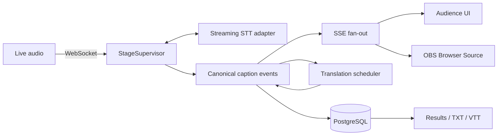

# Project Drake

**Open-source real-time multilingual captions and translation platform for live events.**

**Live Demo:** self-hosted via the Quick Start · [Video Demo](https://www.youtube.com/watch?v=T6VgxivQHKY) · [Documentation](./docs/README.md)

Project Drake turns live stage audio into original captions and translated subtitles for audience screens, mobile browsers, broadcast overlays, persisted transcripts, and subtitle exports.

Built for Nerdearla Vibeathon 2026 and released under the Apache License 2.0.

## Why Drake

Multi-stage events need accessibility and simultaneous translation, but manually operated tools and separate pipelines per stage or viewing surface are difficult to scale. Drake provides one isolated caption pipeline per stage and distributes its canonical output to every consumer.

## Features

- Live browser microphone ingest over WebSocket using PCM16 mono at 16 kHz.
- Streaming original transcription with replaceable partials and durable finals.
- Real-time translation between Spanish, English, and Portuguese.
- One source language with multiple translation targets per talk.
- Multiple concurrent stages with independent `StageSupervisor` instances.
- Event, stage, and talk management with talk history and results pages.
- Responsive Audience UI with original, translation, and combined modes.
- Transparent OBS Browser Source using the same captions as Audience.
- Canonical caption events, PostgreSQL persistence, and SSE reconnection.
- TXT and VTT exports generated from the canonical audio timeline.
- Audio reconnect, provider-session rotation, ring-buffer replay, and operations health.
- Docker-based local development and a Google Cloud Run reference deployment.

## Architecture



- Original captions never wait for translation.
- Translation failure cannot interrupt original captions.
- Audience and OBS consume the same canonical caption stream.
- Audio sample position owns the subtitle timeline.
- Partials are realtime and replaceable; finals are durable and idempotent.
- Provider payloads are normalized before reaching storage or browsers.
- The reference implementation is Google-first, but model access stays behind provider interfaces.

Read the [detailed architecture and failure behavior](./docs/ARCHITECTURE.md).

## Quick Start

### Requirements

- Node.js 24+
- pnpm 11+
- Docker with Compose
- A Google Cloud project with Vertex AI/Gemini and Cloud Translation enabled
- Application Default Credentials, or a Gemini API key for the STT adapter

### Local development

```bash
git clone https://github.com/bautista-ai-builder/project-drake.git
cd project-drake
cp .env.example .env
docker compose up -d postgres
pnpm install --frozen-lockfile
pnpm --filter @drake/server db:migrate
pnpm --filter @drake/server db:seed
pnpm dev
```

For Vertex AI authentication:

```bash
gcloud auth application-default login
gcloud auth application-default set-quota-project YOUR_PROJECT_ID
```

Set `GOOGLE_CLOUD_PROJECT` in `.env`. Replace the example values with secrets of at least 32 characters for `INGEST_JWT_SECRET` and 24 characters for `OPS_API_KEY`. Never commit `.env`.

Development uses Vite on `http://localhost:5173` and the API on `http://localhost:3000`. The production container serves both from port `3000`.

### Production container

```bash
docker build -t project-drake:local .
docker run --rm -p 3000:3000 --env-file .env project-drake:local
```

The container needs network access to PostgreSQL and the configured model providers. In production, supply Google credentials through workload identity or a runtime service account—never bake credentials into the image.

See the [Google Cloud deployment guide](./docs/DEPLOY_GCP.md) for the reference topology and portable alternatives.

## OBS Browser Source

Project Drake exposes a transparent web overlay compatible with OBS Browser Source:

```text
https://YOUR_DRAKE_HOST/overlay/nerdearla-2026/main?lang=es&mode=both
```

Audience and OBS consume the same canonical caption stream; the overlay does not create another transcription pipeline. See the [OBS setup guide](./docs/OBS_BROWSER_SOURCE.md).

## Testing and validation

```bash
pnpm check
pnpm build
```

The release passed:

- 42/42 automated tests.
- Five-stage local realtime gate.
- Five-stage Cloud Run realtime gate.
- Product flow verification.
- Persistence and health verification.

These are project validation results, not general provider benchmarks.

## Current limitations

- Controlled acoustic benchmarking for Spanish and Portuguese speakers remains pending.
- Mandarin support is not part of this release.
- Post-talk summaries, highlights, quotes, and social content are not implemented.
- Local Whisper/faster-whisper execution is an adapter path, not a shipped fallback runtime.
- Five stages are validated on one application instance; distributed stage leases and multi-instance ownership are not implemented.

## Documentation

- [Documentation index](./docs/README.md)
- [Architecture](./docs/ARCHITECTURE.md)
- [OBS Browser Source](./docs/OBS_BROWSER_SOURCE.md)
- [Google Cloud deployment](./docs/DEPLOY_GCP.md)
- [Troubleshooting](./docs/TROUBLESHOOTING.md)
- [Security policy](./SECURITY.md)
- [Contributing](./CONTRIBUTING.md)

## License

Project Drake is licensed under the [Apache License 2.0](./LICENSE).
