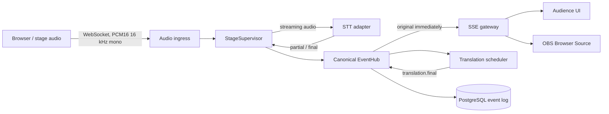

# Project Drake architecture

Project Drake is a modular monolith built around one isolated `StageSupervisor` per live stage. Provider payloads are normalized before they reach persistence or clients.

## Runtime boundaries

- Audio sample position is the canonical clock. Provider arrival time is never used for subtitle timing.
- Partials are ephemeral and replaceable. Finals, translations, gaps and status events are durable and idempotent.
- Translation is queued per talk and target language. It has a bounded timeout/retry policy and never blocks the original transcript.
- Durable persistence uses an in-memory retry queue. A temporary PostgreSQL outage marks health degraded while live delivery continues.
- A failed STT session opens a replacement session, replays up to two seconds from the audio ring buffer and advances the provider epoch.
- Audience and OBS consume exactly the same SSE event stream. `Last-Event-ID` replays durable events after reconnect.

## Provider boundary

`SttProvider` and `TranslationProvider` are the only model-facing interfaces. The current reference adapters are Gemini live transcription and Google Cloud Translation Advanced. A local Whisper or alternative translation adapter can implement the same contracts without changing the frontend.

## Scaling boundary

Five concurrent stages are validated on one process. Supervisors are logically independent, so the next scale step is stage-affine routing plus a database-backed lease per stage. The current in-memory registry is intentionally not a distributed lease manager; deploy the reference implementation with one application instance. Horizontal multi-instance ownership is future work.

## Failure behavior

| Failure | Live original | Translation | Durability | Recovery |
| --- | --- | --- | --- | --- |
| Translation provider | Continues | Degraded | Original persists | Two bounded attempts |
| PostgreSQL temporary outage | Continues via SSE | Continues | Buffered in memory | Automatic drain |
| STT session disconnect | Audio accepted into ring | Delayed | Existing finals safe | New epoch + replay, three attempts |
| Browser/SSE disconnect | STT continues | Continues | Continues | Native reconnect + durable replay |
| Ingest reconnect | Resumes from server cursor | Continues | Explicit gap if buffer is exhausted | Sample-offset handshake |

Known limitation: the persistence retry queue is process memory. A simultaneous database outage and process termination can lose events not yet flushed. A disk spool or external durable bus is the production hardening path.
